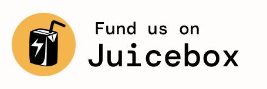

# juice-widgets

🧃 Juicy website widgets for Juicebox projects.

## Tools

### Assets

#### Buttons

| name                     | asset                                             | URL                                                            |
| ------------------------ | ------------------------------------------------- | -------------------------------------------------------------- |
| Juicebox Button (black)  |   | https://tools.juicebox.money/public/juicebox-button-black.png  |
| Juicebox Button (yellow) |  | https://tools.juicebox.money/public/juicebox-button-yellow.png |
| Juicebox Button (white)  |   | https://tools.juicebox.money/public/juicebox-button-white.png  |

### Embed

#### Project balance

> Only supports projects on Juicebox V2

Add an `iframe` to your website, with the following URL as `src`: https://tools.juicebox.money/embed/volume/v2/p/:projectId

```html
<iframe src="https://tools.juicebox.money/embed/balance/v2/p/4" />
```

#### Project volume (total raised)

> Only supports projects on Juicebox V2

Add an `iframe` to your website, with the following URL as `src`: https://tools.juicebox.money/embed/volume/v2/p/:projectId

```html
<iframe src="https://tools.juicebox.money/embed/volume/v2/p/4" />
```
